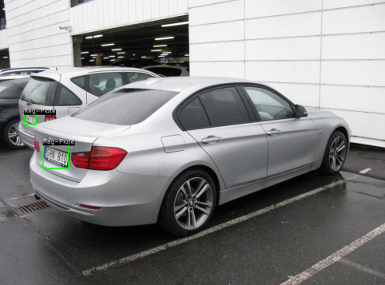
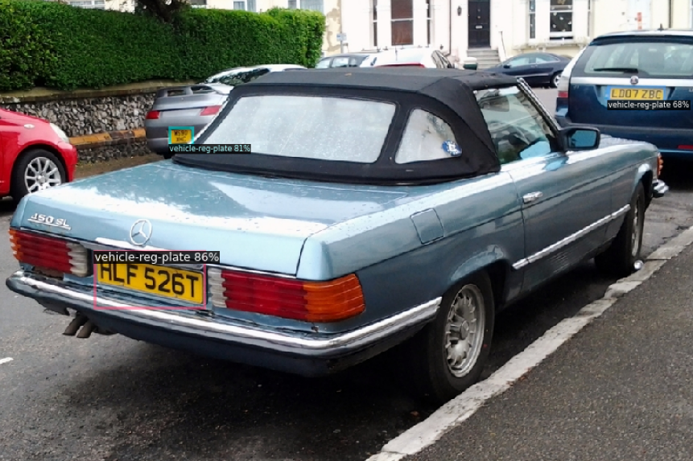

  
  
  

# OPEN CV - Object Classification competition  

This competition is about recognition of Kenyan food images.

Evaluation metric is Accuracy score.

## Documentation

- [Pytorch](https://pytorch.org/docs/stable/index.html)
- [Pytorch Lightning](https://lightning.ai/docs)
- [Pandas](https://pandas.pydata.org/docs/index.html)
- [sklearn](https://scikit-learn.org/stable/user_guide.html)

## Acknowledgements

 - We thank M. Jalal, K. Wang, S. Jefferson, Y. Zheng, E. O. Nsoesie, and M. Betke for providing the dataset. It could be found here: [Kenyan food DataSet](https://github.com/monajalal/Kenyan-Food)

 

## Evaluation
The evaluation metric for this competition is Accuracy score. It is the ratio of number of correct predictions to the total number of input samples. In classification task the Accuracy score is given by:

$$\text{Acc} = \frac{\text{Number of correct predictions}}{\text{Total number of predictions}}$$

We can calculate Accuracy score using Confusion Matrix as follows:

$$\text{Acc} = \frac{\sum_{i=1}^n M_ii}{\sum_{i=1}^n-1\sum_{j=1}^n-1 M_ij}\$$

$$\text{Where M = Confusion Matrix}$$

**Submission Format**

For every image in the dataset (list of the image IDs is shown in the test.csv file) submission files should contain two columns: Image ID and Image Class.

The file should contain a header and have the following format:

| id | class |
| --- | --- |
| 9156739011499789258 | pilau |
| 2049465964503133373 | nyamachoma |
| 1234567890123456789 | ugali |

## Dataset Description
The dataset consists of 8,174 images in 13 Kenyan food type classes. Sample images of KenyanFood13 dataset and the number of images in each of the classes are shown below:

The data was splitted into public train set and private test set which is used for evaluation of submissions. You can split public subset into train and validation sets yourself.

You must create a model that predicts a type of food represented on each image.

**File descriptions**
- train.csv - the training set, contains image ids with corresponding labels
- test.csv - the test set, contains image ids
- sample_submission.csv - a sample submission file in the correct format
- images - the image files (each image is named with its corresponding id)

**Data fields**
- id - id of the image
- class - the class which corresponds to the image.
## Sections and Goals

**Sections**
* Data Loader
* Configuration
* Evaluation Metric
* Train and Validation
* Model
* Utils 
* Experiment 
* Tensorboard Dev Scalar Log link 
* [Kaggle Profile Link](https://www.kaggle.com/competitions/opencv-pytorch-dl-course-classification)  

**Goal**

Share your Kaggle profile link with us here to score , points in the competition.

For full points, you need a minimum accuracy of 75% on the test data. If accuracy is less than 70%, you gain no points for this section.

Submit submission.csv (prediction for images in test.csv), in the Submit Predictions tab in Kaggle, to get evaluated for this section 
## Results

**Results for 100 epochs**

Data seems to overfit, accuracy reached 74.726 %:

**Results after 58 epochs**

Accuracy improved to 76.427

**Conclusions**
Seems that iterating through less epochs by reading the first test improves the accuracy metric of the model, this is due to an overfitting behaviour causing thus divergence towards the goal
## Citation

OpenCV Courses, Prakash Chandra, Satya Mallick, veb, VikasGupta. (2020). OpenCV Pytorch Course - Classification. Kaggle. https://kaggle.com/competitions/opencv-pytorch-dl-course-classification